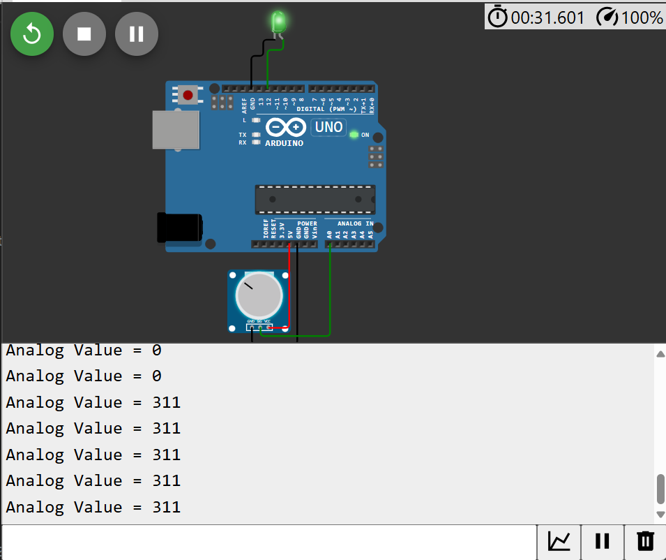
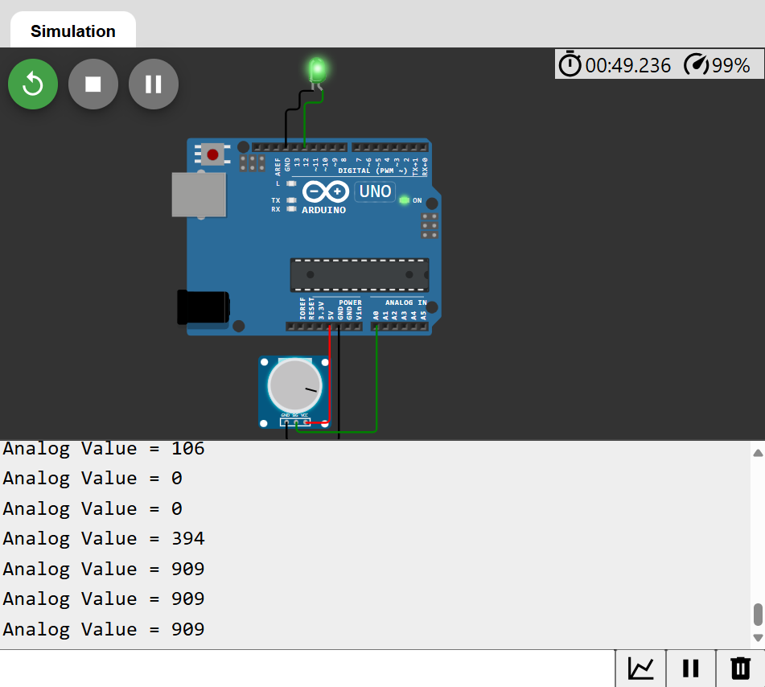

# Problem-1: Getting Started with TaskScheduler
### Objective
- Familiarize yourself with the TaskScheduler library by implementing a simple periodic scheduler.
### Tasks
1. Install the TaskScheduler library from the Arduino IDE Library Manager.
2. Create a program that performs the following:
    - **Task 1:** Blink an LED every 500 milliseconds.
    - **Task 2:** Read an analog input (e.g., from a potentiometer) every 1 second and print the value to the Serial Monitor.
### Deliverables
- A working sketch demonstrating the two tasks.
- Comments in the code explaining how the library schedules and executes tasks.
---
## Code Commented:

```cpp
// Include the TaskScheduler library for managing periodic tasks.
#include <TaskScheduler.h> 

// Define the pin number connected to the LED.
#define LED_PIN 12

// Create a Scheduler object to manage tasks.
Scheduler st;

// Function to toggle the LED state.
void blink() {
  // Change the LED state by writing the opposite of its current state.
  digitalWrite(LED_PIN, !digitalRead(LED_PIN)); 
}

// Function to read the analog value from the potentiometer.
void readPot() {

  // Read the analog input value from pin A0.
  int value = analogRead(A0); 

  // Send The Analog Value to serial monitor
  Serial.print("Analog Value = "); 
  Serial.println(value); 
}

// Create a task named `lblink` to run the `blink` function every 500 ms.
// TASK_FOREVER means the task will run indefinitely.
// &st links the task to the Scheduler instance.
Task lblink(500, TASK_FOREVER, blink, &st); 

// Create a task named `pot` to run the `readPot` function every 1000 ms.
Task pot(1000, TASK_FOREVER, readPot, &st); 

void setup() {
  
  // Initialize serial communication at a baud rate of 9600.
  Serial.begin(9600); 
  
  // Set the LED pin as an output pin.
  pinMode(LED_PIN, OUTPUT);
  
  // Enable the `lblink` task. 
  lblink.enable();
  
  // Enable the `pot` task. 
  pot.enable(); 
}

void loop() {
  // Call the Scheduler's `execute` method to run enabled tasks as per their schedules.
  st.execute(); 
}
```

## Wokwi simulation

### Photo 1


### Photo 2


### Link:
https://wokwi.com/projects/415898738188823553