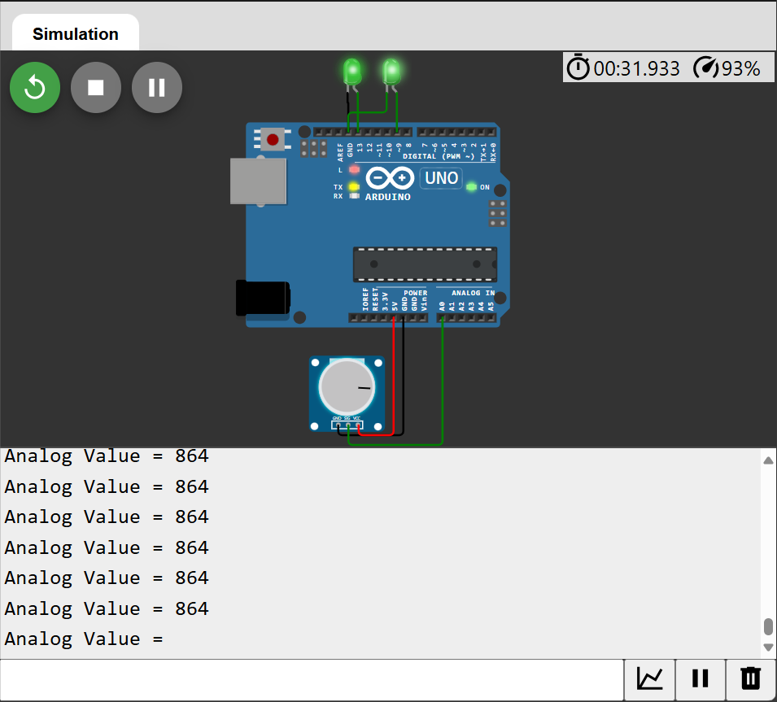

# Problem-2: Adding Task Control and Dependencies
## Objective
- Enhance your understanding of task management by adding task control mechanisms and handling task dependencies.
## Tasks
1. Add a new task:
    - **Task 3:** Generate a PWM signal to control the brightness of an LED every 100 ms.
2. Introduce task control:
    - Pause Task 2 (analog read) when Task 3 (PWM) is running.
    - Resume Task 2 when Task 3 completes.
3. Modify Task 1 (LED blink) to depend on Task 2:
    - Task 1 executes only if the analog input value exceeds a threshold (e.g., 512)
## Deliverables
### Code Commented:
```cpp
#include <TaskScheduler.h> 
// Include the TaskScheduler library for managing periodic tasks.

#define LED_PIN 13 
// Define the pin number for the LED.

#define PWM_PIN 9 
// Define the pin number for the PWM output (connected to an LED or motor).

#define THREE_SHOLD 512 
// Define a threshold value for the potentiometer reading (mid-point of a 10-bit ADC).

// Create a Scheduler object to manage all tasks.
Scheduler st; 

// Declare task functions.
void readPot();  // Function to read the potentiometer value.
void blink();    // Function to blink the LED based on the potentiometer value.
void pwmLed();   // Function to control PWM brightness of an LED.

// Create a task for blinking the LED every 500 ms, linked to the Scheduler.
Task lblink(500, TASK_FOREVER, blink, &st); 

// Create a task for reading the potentiometer every 1000 ms, linked to the Scheduler.
Task pot(1000, TASK_FOREVER, readPot, &st); 

// Create a task for controlling PWM brightness every 100 ms, linked to the Scheduler.
Task pwm(100, TASK_FOREVER, pwmLed, &st); 

void setup() {
  // Initialize serial communication at a baud rate of 9600.
  Serial.begin(9600); 
  
  // Set the LED pin as an output pin.
  pinMode(LED_PIN, OUTPUT);

  // Set the PWM pin as an output pin.
  pinMode(PWM_PIN, OUTPUT);
  
  // Enable the blinking task.
  lblink.enable();
  
  // Enable the potentiometer reading task.
  pot.enable(); 

  // Enable the PWM brightness control task.
  pwm.enable();
}

void loop() {
  // Execute all enabled tasks in the scheduler.
  st.execute(); 
}

void blink() {
  // Read the analog value from the potentiometer (pin A0).
  int value = analogRead(A0); 

  // If the potentiometer value is greater than or equal to the threshold, toggle the LED.
  if (value >= THREE_SHOLD) {
    digitalWrite(LED_PIN, !digitalRead(LED_PIN)); 
  }
}

void readPot() {
  // Read the analog value from the potentiometer (pin A0).
  int value = analogRead(A0); 

  // Print the potentiometer value to the serial monitor.
  Serial.print("Analog Value = "); 
  Serial.println(value);
}

void pwmLed() {
  // Disable the potentiometer reading task temporarily.
  pot.disable();

  // Define a static variable to hold the brightness level (0-255).
  static unsigned char brightness = 0;

  // Increment the brightness by 10 each time the function is called.
  brightness += 10;

  // Write the brightness level to the PWM pin.
  analogWrite(PWM_PIN, brightness);

  // Re-enable the potentiometer reading task.
  pot.enable();
}

```
#### Photo 1:


#### Photo 2:

#### Wokwi Simulation:
https://wokwi.com/projects/415901207296488449

--- 

### How Tasks Interact & How Dependencies Are Handled

#### Tasks Interaction : -

- Tasks can interact by influencing each other's behavior through shared variables or control methods. 
- We use the `enable()` and `disable()` functions which are part of `Task` class.
1. **enable() :** used to enable the task running (ready state).  
2. **disable() :** used to disable the task running (blocked or suspended state).

- So i use `disable()` API at the start of `task3` to disable `task2` from execution, then i call `enable()` at the end to enable execution of `task2`, this is how task2 is being controlled using `task3`.

---

#### Task Dependencies : -

- Tasks depends on each other in the following cases(examples):
1. Task execution depends on the output or execution of another task.
2. Task shares a resource with other tasks.

- Here we handle task dependancies using `enable()` and `disable()` APIs, so `task2` depends on execution of `task3`
