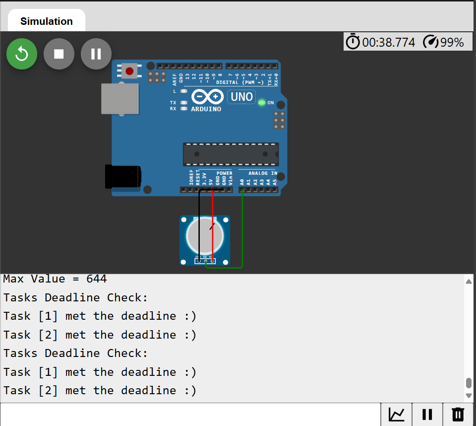

# Problem-3: Monitoring and Dynamic Task Addition
## Objective
- Learn how to dynamically manage tasks during runtime and monitor task execution.
## Tasks
1. Add dynamic task management:
    - Dynamically add a task to log the highest analog value observed over a period.
    - The task logs data every 5 seconds and runs only for 3 cycles before being deleted.
2. Add a monitoring feature:
    - Track missed deadlines for all tasks and print the count to the Serial Monitor.
3. Test the dynamic addition/removal of tasks and ensure the scheduler handles them correctly.

## Deliverables
### Code Commented
```cpp
// Include the TaskScheduler library to manage tasks
#include <TaskScheduler.h>

// Create a scheduler object to coordinate tasks
Scheduler sc;

// Define task IDs for easy reference
#define READ_ANALOG_TASK 0
#define LOG_HIGHEST_VALUE_TASK 1
#define MONITOR_TASKS_TASK 2

// Define the analog input pin
#define ANALOG_PIN A0

// Declare functions for the tasks
void readAnalog();
void monitorTasks();
void logHighestValue();

// Array to store the required periodicity for each task in milliseconds
unsigned long task_reqPeroidicity[] = {100, 5000, 2000};

// Array to store the actual periodicity (execution interval) for each task
unsigned long task_realPeroidicity[] = {0, 0};

// Array to store the last start time of each task
unsigned long task_startTime[] = {0, 0};

// Define a task to read analog values from a sensor
Task task1(
  task_reqPeroidicity[READ_ANALOG_TASK], // Task interval in milliseconds
  TASK_FOREVER,                         // Task will run indefinitely
  readAnalog,                           // Function to execute for this task
  &sc                                   // Scheduler managing this task
);

// Define a task to monitor the status of other tasks
Task task3(
  task_reqPeroidicity[MONITOR_TASKS_TASK], // Task interval in milliseconds
  TASK_FOREVER,                            // Task will run indefinitely
  monitorTasks,                            // Function to execute for this task
  &sc                                      // Scheduler managing this task
);

// Define a task to log the highest analog value
Task task2(
  task_reqPeroidicity[LOG_HIGHEST_VALUE_TASK], // Task interval in milliseconds
  3,                                           // Task runs three times
  logHighestValue,                             // Function to execute for this task
  &sc                                          // Scheduler managing this task
);

// Array of pointers to all tasks for iteration in monitoring
Task *tasks[] = {&task1, &task2};

// Array to store the start time of each task
unsigned long tasks_startTime[] = {0, 0};

// Array to store the real periodicity (actual interval) of each task
unsigned long tasks_realPeroidicity[] = {0, 0};

// Counter to track task2 execution triggers
unsigned char task2_counter = 0;

// Variable to store the maximum analog value
unsigned int max_analog = 0;

// Setup function to initialize the system
void setup() {
  // Begin serial communication at 9600 baud rate
  Serial.begin(9600);

  // Enable the readAnalog task
  task1.enable();

  // Enable the monitorTasks task
  task3.enable();
}

// Main loop to continuously execute tasks
void loop() {
  // Execute all enabled tasks in the scheduler
  sc.execute();
}

// Function to read analog values and monitor for the highest value
void readAnalog() {
  // Calculate the actual periodicity for this task
  task_realPeroidicity[READ_ANALOG_TASK] = millis() - task_startTime[READ_ANALOG_TASK];

  // Update the start time for this task
  task_startTime[READ_ANALOG_TASK] = millis();

  // Read the current analog value from the sensor
  unsigned int value = analogRead(ANALOG_PIN);

  // Update the maximum analog value if the current value is higher
  if (value > max_analog) {
    max_analog = value;
  }

  // Check if the task to log the highest value is disabled
  if (!task2.isEnabled()) {
    // Increment the task3 counter
    task2_counter++;
    // If task3_counter reaches 50, re-enable task3
    if (task2_counter == 50) {
      task2_counter = 0;    // Reset the counter
      sc.addTask(task2);    // Add task3 to the scheduler
      task2.restart();       // Enable task3
    }
  }
}

// Function to monitor and check task deadlines
void monitorTasks() {
  // Print a header message for monitoring output
  Serial.println("Tasks Deadline Check:");

  // Iterate through the tasks to check their status
  for (int i = 0; i < 2; i++) {
    // Check if the task is disabled
    if (!tasks[i]->isEnabled()) {
      // Print a warning if the task is not enabled
      Serial.println("Task [" + String(i + 1) + "] is not enabled !!");
    }
    // Check if the actual periodicity exceeds the required periodicity
    else if (task_reqPeroidicity[i] < task_realPeroidicity[i]) {
      // Print a message indicating the task missed its deadline
      Serial.println("Task [" + String(i + 1) + "] Missed Deadline :(");
    } else {
      // Print a message indicating the task met its deadline
      Serial.println("Task [" + String(i + 1) + "] met the deadline :)");
    }
  }
}

// Function to log the highest analog value
void logHighestValue() {
  // Calculate the actual periodicity for this task
  task_realPeroidicity[LOG_HIGHEST_VALUE_TASK] = millis() - task_startTime[LOG_HIGHEST_VALUE_TASK];

  // Update the start time for this task
  task_startTime[LOG_HIGHEST_VALUE_TASK] = millis();

  // Log the maximum analog value
  Serial.println("Max Value = " + String(max_analog));
}

```

#### Photo 1:


#### Photo 2:


#### Wokwi Simulation  
https://wokwi.com/projects/415938071107002369

### How The Library Handles Dynamic Changes & Tracks Missed Deadlines

- The **TaskScheduler** library manages dynamic task scheduling and tracks missed deadlines through the following mechanisms:

#### 1. **Task Creation and Scheduling**: 
- Tasks are created with specified periodicities (e.g., `task_reqPeroidicity[LOG_HIGHEST_VALUE_TASK] = 2000` for `task3`). These periodicities define the expected intervals between task executions.
- Tasks are added to the scheduler using `sc.addTask(task)` and enabled using `task.enable()`, which makes them eligible for execution.

#### 2. **Dynamic Task Handling**: 
- The scheduler allows tasks to be dynamically added, enabled, or disabled at runtime. For example, `task3` is initially disabled, and it is enabled after a counter reaches a certain value in `readAnalog()`, allowing the task to run.
- The periodicity of tasks can be updated dynamically in the loop or callback functions, depending on the real execution times tracked.

#### 3. **Tracking Deadlines**:
- In the `monitorTasks()` function, the code tracks whether tasks meet their expected periodicity. It checks if the real periodicity (`task_realPeroidicity`) exceeds the required periodicity (`task_reqPeroidicity`). 
- If the actual execution time is greater than the expected time (indicating that the task was delayed), a "Missed Deadline" message is printed. 
- The actual time is tracked using `millis()` to measure elapsed time between task executions and compare it against the required interval.

#### 4. **Restarting Tasks**:
- When `task3` completes its three iterations, it’s automatically restarted by calling its `onDisable` callback function (`restartTask3()`), which resets the task’s iteration count and re-enables it.
