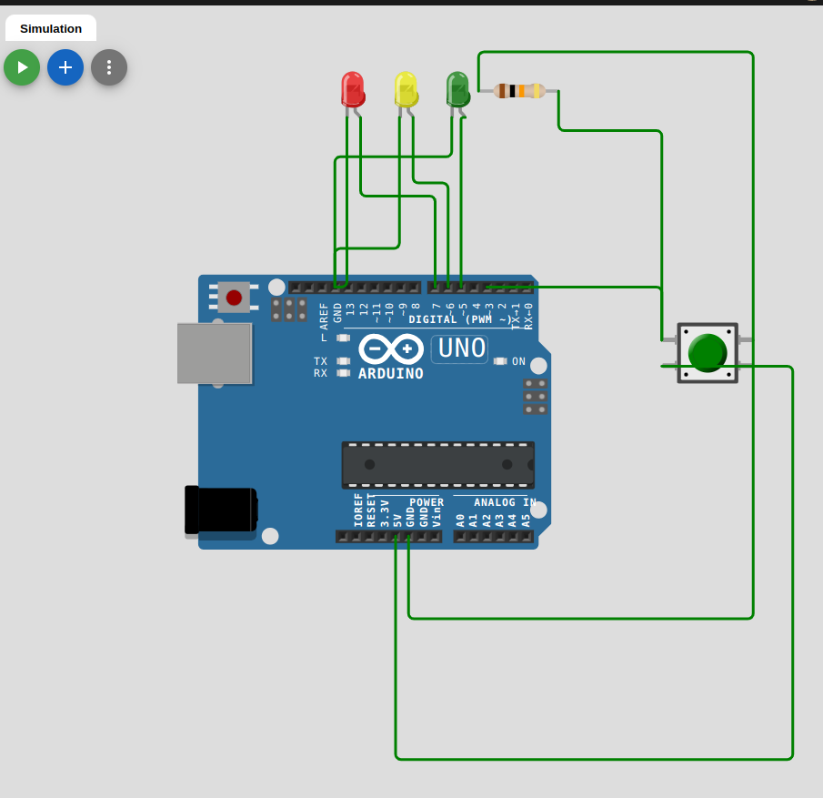

# Problem-4: Building a Real-Time Application(Traffic Light Controller)
## Objective
- Apply your knowledge of real-time scheduling to solve a complex problem using multiple
tasks.
## Project Options
1. **Traffic Light Controller:**
    - Simulate a traffic light system with three states: Green (5s), Yellow (2s), and Red (5s).
    -  Use a separate task to monitor a pedestrian button and interrupt the traffic light sequence if pressed.
    - **I Choose that project**
2. **Multisensor Logger:**
    - Read data from three sensors (e.g., temperature, humidity, light) at different intervals.
    - Aggregate the data every 5 seconds and transmit it over serial.
    - Use a task to alert if any sensor value exceeds a threshold.
3. **Interactive LED Game:**
    - Implement a reaction-time game:
        - Randomly turn on an LED.
        - Measure how quickly a player presses a button.
        - Display the reaction time on the Serial Monitor.
## Deliverables

- A sketch implementing one of the projects.
- A flowchart or timeline showing task execution.
- A report describing challenges faced and solutions implemented.

## Submission Requirements

### Fully commented sketches for each Task.
```cpp
#include <TaskScheduler.h>  // Include the TaskScheduler library for multitasking
Scheduler sc;               // Create a scheduler instance to manage tasks

// Define task indices for readability
#define RED_TASK    0
#define GRN_TASK    1
#define YELLOW_TASK 2
#define BTN_TASK    3

// Define pin numbers for the LEDs and button
#define RED_LED    7
#define YELLOW_LED 6
#define GRN_LED    5
#define BTN        3

// Function prototypes for task callbacks and interrupt handler
void red_led();
void green_led();
void yellow_led();
void button();
void btnHandler();

// Array to store the periods (delays) for each task in milliseconds
unsigned int tasksPeroid[] = {5000, 5000, 2000, 100};

// Flag to track if the button was pressed
bool pushed = false;

// Task objects for each LED and the button
Task redTask(tasksPeroid[RED_TASK], TASK_FOREVER, red_led, &sc);   // Red LED task
Task greenTask(tasksPeroid[GRN_TASK], TASK_FOREVER, green_led, &sc); // Green LED task
Task yellowTask(tasksPeroid[YELLOW_TASK], TASK_FOREVER, yellow_led, &sc); // Yellow LED task
Task buttonTask(tasksPeroid[BTN_TASK], TASK_FOREVER, button, &sc);  // Button task

void setup() {
    // Configure LED pins as outputs
    pinMode(RED_LED, OUTPUT);
    pinMode(GRN_LED, OUTPUT);
    pinMode(YELLOW_LED, OUTPUT);

    // Configure built-in LED and button pin
    pinMode(LED_BUILTIN, OUTPUT);
    pinMode(BTN, INPUT);

    // Attach an interrupt to the button pin (rising edge triggers the interrupt)
    attachInterrupt(digitalPinToInterrupt(BTN), btnHandler, RISING);

    // Ensure all LEDs are initially OFF
    digitalWrite(RED_LED, LOW);
    digitalWrite(GRN_LED, LOW);
    digitalWrite(YELLOW_LED, LOW);

    // Enable the green light task and button task at startup
    greenTask.enable();
    buttonTask.enable();
}

void loop() {
    // Execute tasks managed by the scheduler
    sc.execute();
}

// Callback function for the red LED task
void red_led() {
    // Disable tasks for yellow and green LEDs while red is active
    yellowTask.disable();
    greenTask.disable();

    // Turn ON the red LED and turn OFF the others
    digitalWrite(RED_LED, HIGH);
    digitalWrite(GRN_LED, LOW);
    digitalWrite(YELLOW_LED, LOW);

    // Wait for the red task period
    delay(tasksPeroid[RED_TASK]);

    // Enable the green LED task after red finishes
    greenTask.enable();

    // Reset the pushed flag as the cycle is restarting
    pushed = false;
}

// Callback function for the green LED task
void green_led() {
    unsigned long start = millis(); // Record the start time for the task

    // Disable tasks for yellow and red LEDs while green is active
    yellowTask.disable();
    redTask.disable();

    // Turn ON the green LED and turn OFF the others
    digitalWrite(RED_LED, LOW);
    digitalWrite(GRN_LED, HIGH);
    digitalWrite(YELLOW_LED, LOW);

    // Keep the green LED ON for the specified period or until the button is pressed
    while ((tasksPeroid[GRN_TASK] >= millis() - start) && !pushed);

    // Enable the yellow LED task after green finishes
    yellowTask.enable();
}

// Callback function for the yellow LED task
void yellow_led() {
    // Disable tasks for red and green LEDs while yellow is active
    redTask.disable();
    greenTask.disable();

    // Turn ON the yellow LED and turn OFF the others
    digitalWrite(RED_LED, LOW);
    digitalWrite(GRN_LED, LOW);
    digitalWrite(YELLOW_LED, HIGH);

    // Wait for the yellow task period
    delay(tasksPeroid[YELLOW_TASK]);

    // Enable the red LED task after yellow finishes
    redTask.enable();

    // Reset the pushed flag as the cycle is restarting
    pushed = false;
}

// Callback function for the button task
void button() {
    // Check if the button is pressed and the green task is active
    if (digitalRead(BTN) == HIGH && greenTask.isEnabled()) {
        // Delete and disable the green task
        sc.deleteTask(greenTask);
        greenTask.disable();

        // Turn OFF all LEDs
        digitalWrite(RED_LED, LOW);
        digitalWrite(GRN_LED, LOW);
        digitalWrite(YELLOW_LED, HIGH);

        // Restart the yellow LED task immediately
        yellowTask.enable();

        buttonTask.disable();           // Disable the button task
    }
}

// Interrupt Service Routine (ISR) for the button
void btnHandler() {
    pushed = true;                 // Set the flag to indicate the button was pressed
    buttonTask.enable();           // Enable the button task to process the event
}
```
## A single PDF file with:
### Code explanations and flowcharts.
- Simulation using **Wokwi**
https://wokwi.com/projects/415948889571240961

#### 1. **Library and Scheduler Setup**
```cpp
#include <TaskScheduler.h>  // Include the TaskScheduler library for multitasking
Scheduler sc;               // Create a scheduler instance to manage tasks
```
- `TaskScheduler.h` is included to handle the scheduling of multiple tasks that will run concurrently without using `delay()` or blocking calls.
- `Scheduler sc;` creates an instance of the `Scheduler` class. This object manages and executes all tasks added to it.

---

#### 2. **Task and Pin Definitions**
```cpp
#define RED_TASK    0
#define GRN_TASK    1
#define YELLOW_TASK 2
#define BTN_TASK    3

#define RED_LED    7
#define YELLOW_LED 6
#define GRN_LED    5
#define BTN        3
```
- These `#define` statements define **constant values** for the task indices (`RED_TASK`, `GRN_TASK`, etc.) and the pin numbers for the LEDs and the button.
  - `RED_TASK`, `GRN_TASK`, `YELLOW_TASK`, and `BTN_TASK` are used as indices for easy reference when managing tasks in the array `tasksPeroid[]`.
  - `RED_LED`, `YELLOW_LED`, `GRN_LED`, and `BTN` represent the Arduino pins connected to the red, yellow, green LEDs, and the button, respectively.

---

#### 3. **Task Prototypes and Period Array**
```cpp
void red_led();
void green_led();
void yellow_led();
void button();
void btnHandler();
unsigned int tasksPeroid[] = {5000, 5000, 2000, 100};
```
- **Function prototypes** for the tasks and the button interrupt handler (`btnHandler`).
- **`tasksPeroid[]`** is an array holding the duration (in milliseconds) each task will run:
  - `tasksPeroid[RED_TASK] = 5000` (5 seconds for red)
  - `tasksPeroid[GRN_TASK] = 5000` (5 seconds for green)
  - `tasksPeroid[YELLOW_TASK] = 2000` (2 seconds for yellow)
  - `tasksPeroid[BTN_TASK] = 100` (button checking task interval)

---

#### 4. **Task Objects**
```cpp
Task redTask(tasksPeroid[RED_TASK], TASK_FOREVER, red_led, &sc);   // Red LED task
Task greenTask(tasksPeroid[GRN_TASK], TASK_FOREVER, green_led, &sc); // Green LED task
Task yellowTask(tasksPeroid[YELLOW_TASK], TASK_FOREVER, yellow_led, &sc); // Yellow LED task
Task buttonTask(tasksPeroid[BTN_TASK], TASK_FOREVER, button, &sc);  // Button task
```
- These `Task` objects define each task that will run in the scheduler:
  - Each `Task` is associated with a function (`red_led`, `green_led`, etc.), an interval (`tasksPeroid`), and a flag for the scheduling behavior (`TASK_FOREVER` makes each task run indefinitely).
  - The scheduler (`&sc`) manages these tasks.

---

#### 5. **Setup Function**
```cpp
void setup() {
    pinMode(RED_LED, OUTPUT);
    pinMode(GRN_LED, OUTPUT);
    pinMode(YELLOW_LED, OUTPUT);
    pinMode(LED_BUILTIN, OUTPUT);  // Built-in LED for indication
    pinMode(BTN, INPUT);           // Button input pin

    attachInterrupt(digitalPinToInterrupt(BTN), btnHandler, RISING);  // Attach interrupt for button

    digitalWrite(RED_LED, LOW);
    digitalWrite(GRN_LED, LOW);
    digitalWrite(YELLOW_LED, LOW);

    // Start the tasks
    greenTask.enable();
    buttonTask.enable();
}
```
- **Pin Mode Setup**:
  - LED pins (`RED_LED`, `GRN_LED`, `YELLOW_LED`) are set as `OUTPUT` because the LEDs are controlled by these pins.
  - The built-in LED (`LED_BUILTIN`) is set as an indicator.
  - The button pin (`BTN`) is set as `INPUT` because it detects user input.
  
- **Interrupt Setup**:
  - `attachInterrupt(digitalPinToInterrupt(BTN), btnHandler, RISING);` attaches an interrupt to the button pin (`BTN`). The interrupt is triggered on the **rising edge** (when the button is pressed and the signal changes from LOW to HIGH). The interrupt calls the `btnHandler` function when activated.

- **LED Initialization**:
  - The LEDs are initially set to `LOW` (off) using `digitalWrite`.

- **Task Initialization**:
  - The `greenTask` and `buttonTask` are enabled, meaning they will start executing when the scheduler runs.

---

#### 6. **Main Loop**
```cpp
void loop() {
    sc.execute();  // Execute the tasks managed by the scheduler
}
```
- The `loop()` function is called continuously in the Arduino program. Here, the `sc.execute()` method is called to run all active tasks managed by the scheduler. This ensures that the tasks execute at their defined intervals without blocking.

---

#### 7. **LED Task Functions**

##### `red_led()`:
```cpp
void red_led() {
    yellowTask.disable();
    greenTask.disable();
    
    digitalWrite(RED_LED, HIGH);  // Turn ON the red LED
    digitalWrite(GRN_LED, LOW);   // Turn OFF the green LED
    digitalWrite(YELLOW_LED, LOW); // Turn OFF the yellow LED

    delay(tasksPeroid[RED_TASK]); // Wait for the red task period (5 seconds)
    greenTask.enable();  // Enable the green LED task to start after red

    pushed = false; // Reset the flag indicating no button press during this cycle
}
```
- The **red LED task** disables the yellow and green LED tasks, then turns on the red LED and keeps it on for `tasksPeroid[RED_TASK]` (5 seconds).
- After the red LED finishes, it re-enables the green LED task.
- The `pushed` flag is reset to `false`, ensuring that no button press was detected during the red light period.

##### `green_led()`:
```cpp
void green_led() {
    unsigned long start = millis();  // Record the start time of the task

    yellowTask.disable();
    redTask.disable();

    digitalWrite(RED_LED, LOW);  // Turn OFF the red LED
    digitalWrite(GRN_LED, HIGH); // Turn ON the green LED
    digitalWrite(YELLOW_LED, LOW); // Turn OFF the yellow LED

    // Wait while the green LED is ON or until the button is pressed
    while ((tasksPeroid[GRN_TASK] >= millis() - start) && !pushed);

    yellowTask.enable();  // Enable the yellow LED task after green finishes
}
```
- The **green LED task** runs while checking the time with `millis()` and ensures that the green LED stays on for the duration defined by `tasksPeroid[GRN_TASK]` (5 seconds).
- If the button is pressed (i.e., `pushed` is set to `true`), the task ends early.
- After the green LED task finishes, the yellow LED task is enabled.

##### `yellow_led()`:
```cpp
void yellow_led() {
    redTask.disable();
    greenTask.disable();

    digitalWrite(RED_LED, LOW);   // Turn OFF the red LED
    digitalWrite(GRN_LED, LOW);   // Turn OFF the green LED
    digitalWrite(YELLOW_LED, HIGH); // Turn ON the yellow LED

    delay(tasksPeroid[YELLOW_TASK]); // Wait for the yellow task period (2 seconds)

    redTask.enable();  // Enable the red LED task after yellow finishes
    pushed = false;    // Reset the flag indicating no button press during this cycle
}
```
- The **yellow LED task** disables the red and green LED tasks and turns on the yellow LED for `tasksPeroid[YELLOW_TASK]` (2 seconds).
- After the yellow LED finishes, the red LED task is enabled, and the `pushed` flag is reset.

---

#### 8. **Button Task (`button()`)**
```cpp
void button() {
    if (digitalRead(BTN) == HIGH && greenTask.isEnabled()) {
        sc.deleteTask(greenTask);  // Delete the green LED task
        greenTask.disable();       // Disable the green LED task

        // Turn off all LEDs and show yellow
        digitalWrite(RED_LED, LOW);
        digitalWrite(GRN_LED, LOW);
        digitalWrite(YELLOW_LED, HIGH);

        yellowTask.enable();  // Restart the yellow LED task
    }
}
```
- The **button task** checks if the button is pressed and the green LED task is currently active.
- If the button is pressed, the green task is deleted (`sc.deleteTask(greenTask)`), and all LEDs are turned off. Then, the yellow LED task is immediately enabled to continue the sequence.

---

#### 9. **Button Interrupt Handler (`btnHandler()`)**
```cpp
void btnHandler() {
    pushed = true;               // Set the flag to indicate the button was pressed
    digitalWrite(LED_BUILTIN, LOW); // Turn ON the built-in LED as an indicator
    buttonTask.enable();         // Enable the button task to process the event
}
```
- The **interrupt service routine (ISR)** `btnHandler()` is triggered by a button press.
- It sets the `pushed` flag to `true` to indicate that the button was pressed.
- The built-in LED (`LED_BUILTIN`) is turned on as an indicator.
- The button task (`buttonTask`) is enabled to handle the button press event.

---
### **Flowchart**


---
### Screenshots or photos of the project in action.
#### Photo 1:

#### Photo 2:

#### Photo 3:

#### Photo 4:


## A brief report summarizing your learning.
1. `TaskScheduler` Basic APIs
2. How to make scheduling between tasks.
3. Tasks Control Mechanisms
4. Handling Tasks Dependencies.
5. How to Monitor the tasks.
6. Add Dynamic Tasks.
7. Solving Complex Problems using tasks.